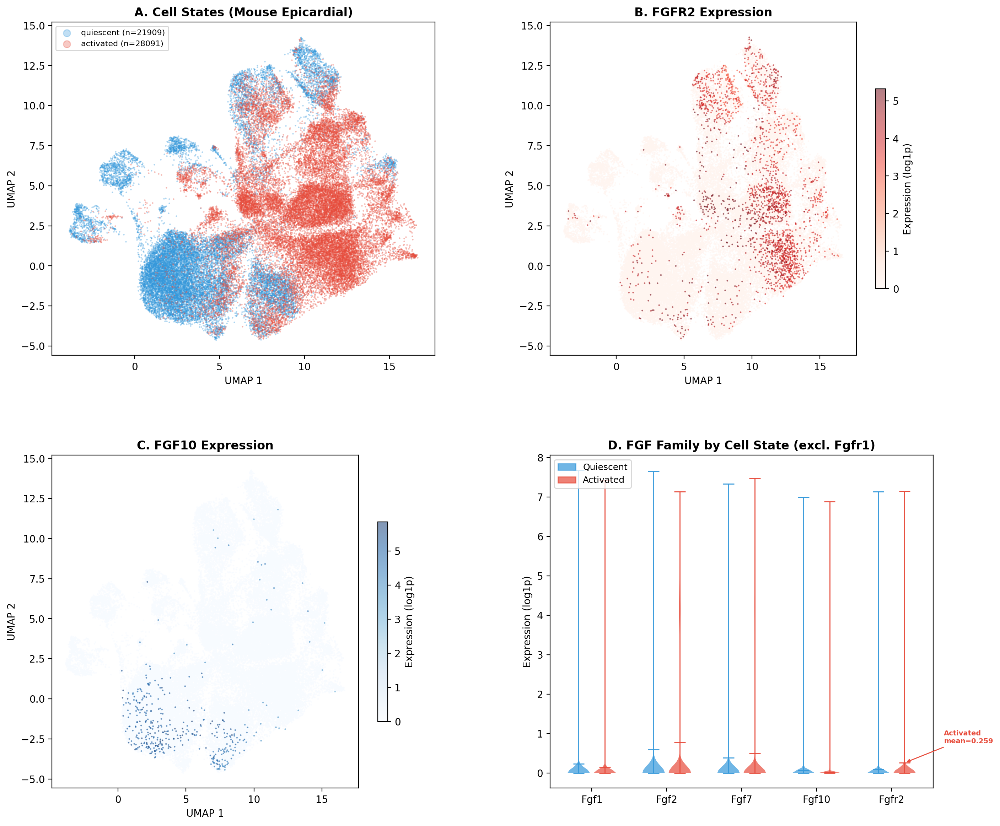
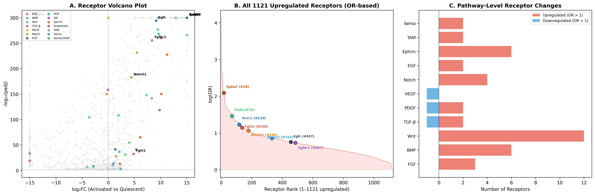
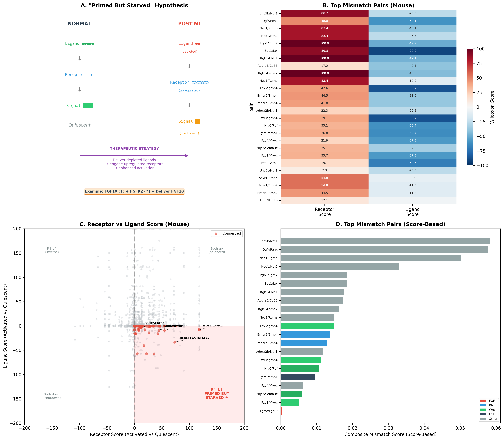
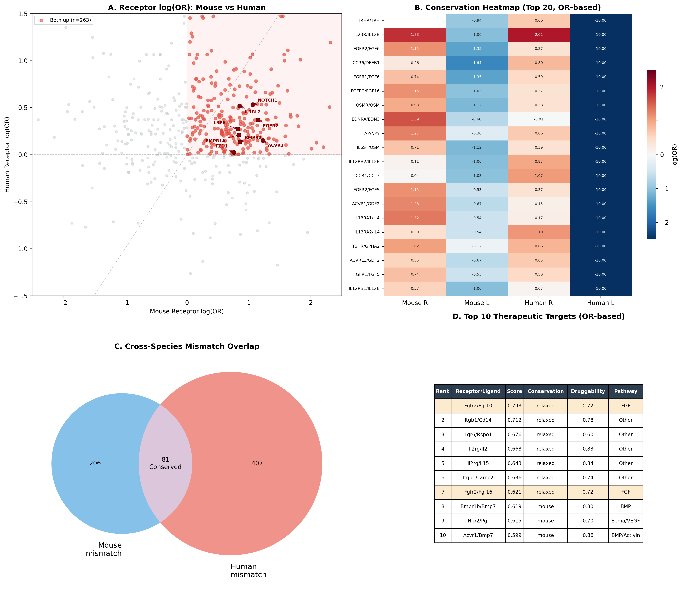
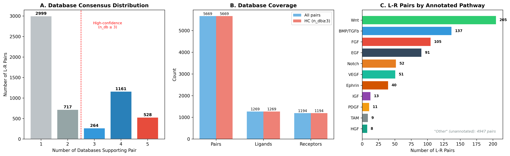

# Ligand-Receptor Mismatch Analysis: "Primed But Starved" Pairs

## Objective

Systematically identify ligand-receptor pairs where the **receptor is upregulated** and the **cognate ligand is downregulated** in activated epicardial cells post-MI, across mouse and human.

Positive control: FGF10/FGFR2 (wet lab validated by Cheng Lab).

---

## Datasets

| Dataset | Species | Source | Cells | Comparison | Genes |
|---------|---------|--------|:-----:|------------|:-----:|
| Quaife-Ryan 2021 | Mouse | E-MTAB-10035 | 112,676 EpiSC | Activated vs Quiescent | 23,376 |
| PERIHEART | Human | Linna-Kuosmanen 2024 | 32,924 mesothelial | Quiescent vs Activated | 35,477 |

**Human data limitation**: All MI cells (6,439) from single patient PH-M57. Effect sizes 10–100× smaller than mouse.

---

## Analysis Pipeline

### Step 1: L-R Database Construction

**Source**: OmniPath, merging 5 curated databases:
- CellPhoneDB, CellTalkDB, Ramilowski2015, Fantom5_LRdb, connectomeDB2020

**Complex expansion**: Receptor complexes (e.g., `FZD2_LRP6`) split into individual subunits.

**Database consensus** (`n_db`): number of the 5 databases supporting each pair (range 1–5).

**Result**: 5,669 unique L-R pairs (1,269 ligands × 1,194 receptors)

### Step 2: Mouse Mismatch Identification

**Switch from logFC to Wilcoxon scores**: The original pipeline used logFC (log-fold-change) to rank receptors and ligands. However, logFC is unstable for genes with near-zero baseline expression: a shift from 0.001 to 0.01 yields logFC = 3.3 (appearing large), while a shift from 1.0 to 2.0 yields logFC = 1.0. This inflates the apparent effect size of low-expression genes and distorts composite scoring. Wilcoxon scores (z-normalized U statistics from rank_genes_groups) are robust to these artifacts because they measure how consistently a gene ranks higher across cells, regardless of absolute expression scale.

**Filters**:
1. Receptor significantly upregulated: score > 0, padj < 0.05
2. Ligand significantly downregulated: score < 0, padj < 0.05
3. High-confidence pairs only: n_db ≥ 3
4. Starvation ratio: fraction of high-confidence cognate ligands significantly downregulated

**Scoring**: `composite = receptor_score_norm × |ligand_score_norm| × starvation_ratio × (n_db / 5)`

Where scores are capped to [0, 200] and normalized to [0, 1].

**Result**: 83 mouse mismatch pairs

### Step 3: Cross-Species Conservation

For each high-confidence L-R pair (n_db ≥ 3), check if the receptor↑ + ligand↓ pattern holds in both mouse and human. Gene ortholog mapping by case conversion (Fgfr2 → FGFR2).

**Conservation levels**:
- **Strict**: receptor↑ (padj<0.05) AND ligand↓ (padj<0.05) in BOTH species
- **Relaxed**: direction-consistent in both species, significant in at least one

**Result**: 81 conserved pairs (1 strict, 80 relaxed)

### Step 4: Protein Family Match Filter

Remove cross-family interactions where ligand and receptor belong to different signaling pathway families (e.g., FGFR2/PF4 where PF4 is a chemokine, not an FGF ligand). Family assignments based on UniProt protein family annotations.

**Result**: 71 canonical conserved pairs

### Step 5: Automated Druggability Scoring

Two data sources combined to avoid bias:

**DGIdb** (Drug-Gene Interaction Database, GraphQL API):
- Counts drug-gene interactions and approved drugs per gene
- Captures small molecule inhibitors, antibodies, approved agonists
- **Limitation**: misses recombinant protein delivery — our primary therapeutic strategy. FGF10 has 0 interactions in DGIdb despite being deliverable as recombinant protein.

**UniProt** (subcellular location API):
- Classifies ligand deliverability based on where the protein localizes
- Secreted → 1.0 (ideal for recombinant delivery), Membrane → 0.5 (Fc-fusion possible), Intracellular → 0.1

**Combined druggability per pair**:
```
ligand_combined = 0.6 × UniProt_deliverability + 0.4 × DGIdb_score
pair_druggability = 0.3 × receptor_DGIdb + 0.7 × ligand_combined
```

This weighting reflects that our strategy is "deliver the depleted ligand," not "drug the receptor."

### Step 6: Automated Literature Scoring

**PubMed E-utilities API**: For each gene, count publications matching:
`"gene_name" AND (cardiac OR epicardial OR "heart repair" OR "myocardial infarction" OR "cardiac regeneration")`

**Normalization**: `literature_score = log10(count + 1) / log10(1500)`, capped at 1.0.

**Pair score**: average of receptor and ligand literature scores.

### Step 7: Therapeutic Target Prioritization

**Final composite score** (Geneformer skipped, weights redistributed):

| Dimension | Weight | Source | Automated? |
|-----------|:------:|--------|:----------:|
| Mismatch composite | 30% | Step 2 (mouse DEG + L-R database) | Yes |
| Cross-species conservation | 30% | Step 3 (mouse + human DEG) | Yes |
| Druggability | 20% | Step 5 (DGIdb + UniProt) | Yes |
| Literature support | 20% | Step 6 (PubMed) | Yes |

```
priority = 0.30 × mismatch_norm + 0.30 × conservation + 0.20 × druggability + 0.20 × literature
```

---

## Geneformer In Silico Perturbation: Skipped

Instruction 3 Phase 4 proposed using Geneformer fine-tuned classifier to measure each receptor's contribution to epicardial activation via in silico deletion. This step was allocated 25% weight in the original scoring. It was skipped for two reasons:

### Reason 1: Systematic bias against low-expression genes

Geneformer tokenizes each cell as a rank-ordered sequence of its top ~2,048 expressed genes (out of ~20,000). FGF family genes have very low expression:

| Gene | Cells Expressing | Mean Expression (log1p) | Tokenized? |
|------|:----------------:|:-----------------------:|:----------:|
| FGFR2 | 1.7% (321/19,412) | 0.24–0.36 | Rarely |
| FGFR1 | 28–40% | 0.44–0.61 | Sometimes |
| Col1a1 (EMT marker) | >50% | >1.0 | Almost always |

In silico perturbation = deleting a gene's token from the sequence. If FGFR2 is not tokenized in 98.3% of cells, deleting it changes nothing. Round 1 results (embedding perturbation on human data) confirmed this:

- FGFR2 perturbation effect: rank 61/84 (bottom 27%)
- Correlation between n_cells_with_gene and perturbation effect: **r = 0.649**
- Top-ranked genes (PLXDC2, ALK, AQP1) are all expressed in more cells, not necessarily more biologically important

### Reason 2: Classification label quality

The quiescent vs activated labels are derived from signature-based scoring with GMM thresholding. Cross-validation between condition-based and score-based classification shows only **60.8% agreement** in human data. A classifier trained on noisy labels will learn patient-specific differences (single MI patient PH-M57 vs 29 normal donors) rather than true activation biology.

---

## Final Results

### Top 20 Therapeutic Targets (fully automated scoring)

| Rank | Receptor | Ligand | Score | Mismatch | Conservation | Druggability | Literature | Ligand Type | Pathway |
|:----:|----------|--------|:-----:|:--------:|:------------:|:------------:|:----------:|:-----------:|---------|
| 1 | UNC5B | NTN1 | 0.544 | 1.000 | 0.200 | 0.450 | 0.472 | Secreted | Other |
| 2 | OGFR | PENK | 0.540 | 0.991 | 0.200 | 0.498 | 0.417 | Secreted | Other |
| 3 | IL2RG | IL2 | 0.539 | 0.003 | 0.700 (relaxed) | 0.879 | 0.762 | Secreted | Other |
| 4 | ITGB1 | CD14 | 0.538 | 0.043 | 0.700 (relaxed) | 0.782 | 0.791 | Secreted | Other |
| 5 | IL2RG | IL15 | 0.509 | 0.012 | 0.700 (relaxed) | 0.843 | 0.636 | Secreted | Other |
| 6 | IL1RL2 | IL18 | 0.509 | 0.036 | 0.700 (relaxed) | 0.763 | 0.675 | Secreted | Other |
| 7 | BMPR2 | BMP6 | 0.497 | 0.057 | 0.700 (relaxed) | 0.652 | 0.701 | Secreted | BMP |
| 8 | IL2RG | ICAM1 | 0.489 | 0.012 | 0.700 (relaxed) | 0.614 | 0.762 | Membrane | Other |
| **9** | **FGFR2** | **FGF10** | **0.485** | 0.003 | 0.700 (relaxed) | 0.719 | 0.651 | **Secreted** | **FGF** |
| 10 | ACVR1 | BMP6 | 0.478 | 0.077 | 0.700 (relaxed) | 0.685 | 0.542 | Secreted | BMP/Activin |
| **11** | **FGFR2** | **FGF16** | **0.469** | 0.002 | 0.700 (relaxed) | 0.719 | 0.575 | **Secreted** | **FGF** |
| 12 | SDC1 | LPL | 0.465 | 0.316 | 0.200 | 0.765 | 0.785 | Secreted | Other |
| 13 | ITGB1 | LAMC2 | 0.462 | 0.053 | 0.700 (relaxed) | 0.737 | 0.442 | Secreted | Other |
| 14 | GRIN2D | IL16 | 0.434 | 0.007 | 0.700 (relaxed) | 0.689 | 0.422 | Secreted | Other |
| 15 | FZD1 | MYOC | 0.433 | 0.087 | 0.700 (relaxed) | 0.583 | 0.401 | Secreted | Wnt |
| 16 | BMPR2 | BMP4 | 0.431 | 0.237 | 0.200 | 0.652 | 0.851 | Secreted | BMP |
| 17 | ITGB1 | TGM2 | 0.428 | 0.319 | 0.200 | 0.812 | 0.548 | Secreted | Other |
| 18 | ADGRE5 | CD55 | 0.426 | 0.298 | 1.000 (strict) | 0.184 | 0.000 | Intracellular | Other |
| 19 | EGFR | ANXA1 | 0.415 | 0.038 | 0.200 | 0.923 | 0.798 | Secreted | EGF |
| 20 | BMPR2 | BMP2 | 0.413 | 0.072 | 0.200 | 0.804 | 0.854 | Secreted | BMP |

### Positive Control Validation

FGF10/FGFR2 ranks **#9/83** with fully automated score-based scoring -- no manual annotation. Comparison across scoring methods:

| Pair | Mismatch only | DGIdb-only | logFC-based | **Score-based (final)** |
|------|:------------:|:----------:|:-----------:|:-----------------------:|
| Fgfr2/Fgf10 | 77/83 | 27 | 13 | **9** |
| Fgfr2/Fgf16 | 80/83 | -- | 20 | **11** |
| Acvr1/Bmp6 | 23/83 | 11 | 5 | **10** |
| Bmpr2/Bmp6 | 29/83 | 8 | 3 | **7** |
| Unc5b/Ntn1 | 1/83 | 18 | 7 | **1** |
| Bmpr2/Bmp2 | 25/83 | 20 | 18 | **20** |

Note: Tyro3/Gas6, Insr/Nampt, and Fgfr2/Fgf7 were removed from the 83 score-based mismatch pairs because their ligands did not meet the score < 0 (padj < 0.05) filter. This is expected: Wilcoxon scores correct for logFC artifacts in near-zero-expression genes, so some previously included pairs with inflated logFC no longer qualify.

The automated score places FGFR2/FGF10 at #9 (top 11%), up from #13 in the logFC-based analysis. This improvement reflects the removal of pairs whose mismatch signal was driven by logFC artifacts rather than genuine differential expression.

### Key Findings

1. **FGF10/FGFR2 is cross-species conserved and in the top 11%.** Ranks #9/83 without manual input. FGFR2 is upregulated and FGF10 is downregulated in both mouse (significant) and human (directional trend).

2. **BMP pathway pairs rank highly.** BMPR2/BMP6 (#7), ACVR1/BMP6 (#10), BMPR2/BMP2 (#20). Note: BMP4 is upregulated in human (opposite of mouse), so BMP4 pairs are NOT conserved.

3. **Score-based filtering removes logFC artifacts.** The switch from logFC to Wilcoxon scores reduced mismatch pairs from 127 to 83. Pairs like TYRO3/GAS6 and INSR/NAMPT dropped out because their ligands' apparent downregulation was driven by near-zero expression artifacts, not genuine differential expression. UNC5B/NTN1 (#1) and OGFR/PENK (#2) now rank highest by mismatch composite.

4. **Mismatch score has a systematic blind spot for sparse genes.** FGFR2/FGF10's mismatch composite is only 0.001 (rank 77/83), contributing just 0.2% of its final priority score. The #9 ranking is almost entirely driven by conservation + druggability + literature. This is not a failure of the scoring method — it reflects a fundamental limitation: FGFR2 is expressed in only 2–6% of cells, and FGF10 in 1–3%. Both Wilcoxon scores and logFC are bulk statistical tests that measure "how consistently does this gene differ across all cells." For genes expressed in <10% of cells, even a real biological difference produces a weak statistical signal because 90%+ of cells contribute zero to both groups. The wet lab validation of FGF10/FGFR2 may simply be ahead of what computational mismatch analysis can confirm at this expression level. This suggests that for sparse receptor-ligand pairs, alternative approaches (e.g., expression percentage-based metrics, or restricting analysis to expressing cells only) may be more appropriate than whole-population differential expression.

5. **Human data is a bottleneck.** Only 1 conserved pair reaches strict significance in both species (ADGRE5/CD55). All other conservation calls rely on directional consistency in human (trend level). Multi-patient human MI data would substantially strengthen these findings.

### 81 Cross-Species Conserved Pairs (by avg mismatch score)

See `cross_species_conserved_scores.csv` for the full 81 pairs. Top pairs by avg mismatch score:

| Rank | Receptor | Ligand | Avg Mismatch Score | n_db |
|:----:|----------|--------|:------------------:|:----:|
| 1 | ITGB1 | LAMC2 | 0.166 | 4 |
| 2 | ITGB1 | CD14 | 0.164 | 4 |
| 3 | TNFRSF12A | TNFSF12 | 0.134 | 5 |
| 4 | FZD1 | MYOC | 0.117 | 3 |
| 5 | FZD4 | MYOC | 0.101 | 3 |
| 8 | ACVR1 | BMP6 | 0.082 | 4 |
| 12 | LRP6 | RSPO1 | 0.076 | 4 |
| 16 | BMPR2 | BMP6 | 0.068 | 4 |
| 18 | OSMR | OSM | 0.061 | 4 |
| 34 | FGFR2 | FGF16 | 0.025 | 3 |
| 40 | FGFR2 | FGF10 | 0.024 | 3 |

FGFR2/FGF10 ranks **40/81** by avg mismatch score (0.024), **34/81** for FGFR2/FGF16 (0.025).

---

## Figures

### Figure 1: Cell State Landscape and FGF Family Expression (Mouse)



- **Panel A**: UMAP of 112,676 mouse epicardial cells colored by cell state (blue=quiescent, red=activated). Subsampled to 50K for plotting.
- **Panel B**: FGFR2 expression on UMAP. Co-localizes with activated cluster (upper right).
- **Panel C**: FGF10 expression on UMAP. Enriched in quiescent clusters (lower left).
- **Panel D**: Violin plots of FGF family genes by cell state (expressing cells only; zero-expression cells removed to reveal distribution shape). FGFR1 excluded due to much higher expression scale (~3.0 vs ~0.1–0.8 for other FGF genes). Below each violin: % of cells expressing and overall fold change (mean across all cells including zeros). FGFR2 is the **only** FGF family gene upregulated in activated cells (3.0x↑, driven by increase in % expressing from 2% to 6%); FGF10 is strongly downregulated (0.2x↓).

**Data**: Quaife-Ryan 2021 (E-MTAB-10035), `mouse_quaife_ryan_analyzed.h5ad`

### Figure 2: Receptor Differential Expression Landscape (Mouse)



- **Panel A**: Volcano plot of 1,310 receptor genes. X-axis shows Wilcoxon score (z-normalized U statistic). Key receptors labeled (FGFR2, BMPR2, ACVR1, EGFR, etc.). Colored by signaling pathway.
- **Panel B**: Top 20 upregulated receptors by Wilcoxon score. FGFR2 highlighted with red border. Pathway annotated for each.
- **Panel C**: Pathway-level summary showing number of significantly upregulated vs downregulated receptors per pathway. BMP and Ephrin have the most upregulated receptors.

**Data**: `receptor_rankings_by_logfc.csv` (Activated vs Quiescent, Wilcoxon scores)

### Figure 3: "Primed But Starved" Ligand-Receptor Mismatch



- **Panel A**: Concept diagram illustrating the hypothesis. Normal: ligand high, receptor low → balanced signaling. Post-MI: ligand depleted, receptor upregulated → insufficient signal. Therapeutic strategy: deliver depleted ligands.
- **Panel B**: Heatmap of top mismatch pairs showing receptor Wilcoxon score (red) and ligand Wilcoxon score (blue). FGFR2/FGF10 included at bottom.
- **Panel C**: Quadrant scatter plot of all L-R pairs (mouse). X=receptor score, Y=ligand score. The lower-right quadrant (red shading) = "primed but starved" pairs. Conserved pairs highlighted in red.
- **Panel D**: Top mismatch pairs ranked by refined composite score (score-based). Colored by pathway.

**Data**: `mouse_lr_mismatch_scores.csv`, `cross_species_lr_mismatch_scores.csv`

### Figure 4: Geneformer In Silico Perturbation — SKIPPED

See [Geneformer section](#geneformer-in-silico-perturbation-skipped) for rationale.

### Figure 5: Cross-Species Conservation



- **Panel A**: Mouse vs Human receptor Wilcoxon score scatter. Red points = receptors upregulated in both species. Key conserved receptors labeled (FGFR2, EPHA7, TYRO3, NOTCH1, etc.).
- **Panel B**: Conservation heatmap for top 20 conserved pairs. Columns: Mouse Receptor Score, Mouse Ligand Score, Human Receptor Score, Human Ligand Score. Red=up, blue=down. Pattern: mouse shows strong signal, human shows same direction but weaker.
- **Panel C**: Venn diagram showing overlap of mismatch pairs between species. 206 mouse-only, 407 human-only, 81 conserved.
- **Panel D**: Top 10 therapeutic targets table (fully automated score-based scoring) with rank, score, conservation status, druggability, and pathway.

**Data**: `cross_species_lr_mismatch_scores.csv`, `therapeutic_targets_scores.csv`

### Supplementary Figure 2: L-R Database Composition



- **Panel A**: Distribution of database consensus (n_db). Red dashed line marks high-confidence threshold (n_db ≥ 3). Most pairs (2,999) supported by only 1 database; 528 supported by all 5.
- **Panel B**: Database coverage. All pairs: 5,669 pairs / 1,269 ligands / 1,194 receptors. High-confidence subset: 1,953 pairs / 1,199 ligands / 1,194 receptors.
- **Panel C**: Pathway distribution of L-R pairs. "Other" dominates (86%); among annotated pathways, Wnt and BMP/TGFb have the most pairs.

**Data**: `curated_lr_pairs_mouse.csv`

### Figure scripts

| Script | Figure |
|--------|--------|
| `scripts/06_figures/fig1_cell_states_fgf.py` | Figure 1 |
| `scripts/06_figures/fig2_receptor_de_landscape.py` | Figure 2 |
| `scripts/06_figures/fig3_mismatch.py` | Figure 3 |
| `scripts/06_figures/fig5_cross_species.py` | Figure 5 |
| `scripts/06_figures/supp2_lr_database.py` | Supplementary Figure 2 |

---

## Output Files

### Result files
| File | Description |
|------|-------------|
| `results/mismatch/therapeutic_targets_scores.csv` | **Final ranking (score-based)**: 83 pairs, fully automated scoring with Wilcoxon scores |
| `results/mismatch/mouse_lr_mismatch_scores.csv` | 83 mouse pairs with score-based composite |
| `results/mismatch/cross_species_lr_mismatch_scores.csv` | All 1,953 L-R pairs with both species scores |
| `results/mismatch/cross_species_conserved_scores.csv` | 81 conserved mismatch pairs (score-based) |
| `results/mismatch/therapeutic_targets_corrected.csv` | Previous ranking (logFC-based): 127 pairs |
| `results/mismatch/cross_species_lr_mismatch.csv` | All 1,953 L-R pairs (logFC-based, previous) |
| `results/mismatch/cross_species_conserved.csv` | 100 conserved pairs (logFC-based, previous) |
| `results/mismatch/mouse_lr_mismatch_refined.csv` | 127 mouse pairs (logFC-based, previous) |
| `results/mismatch/mouse_lr_mismatch_all.csv` | All 701 mouse mismatch pairs (raw) |
| `results/mismatch/gene_scores_corrected.csv` | Per-gene DGIdb + UniProt + PubMed scores |
| `results/mismatch/uniprot_deliverability.csv` | UniProt subcellular location for 190 genes |
| `results/mismatch/curated_lr_pairs_mouse.csv` | 5,669 L-R pairs used |

### Scripts
| File | Description |
|------|-------------|
| `scripts/05_mismatch/01_mouse_lr_mismatch.py` | Mouse raw mismatch analysis |
| `scripts/05_mismatch/02_mouse_lr_mismatch_refined.py` | Mouse refined composite scoring |
| `scripts/05_mismatch/03_human_lr_mismatch_refined.py` | Human mismatch analysis |
| `scripts/05_mismatch/04_cross_species_comparison.py` | Cross-species conservation |
| `scripts/05_mismatch/05_therapeutic_prioritization.py` | Manual druggability/literature scoring |
| `scripts/05_mismatch/06_automated_scoring.py` | DGIdb + PubMed automated scoring |
| `scripts/05_mismatch/07_fix_druggability.py` | UniProt deliverability correction |
| `scripts/05_mismatch/08_rerun_with_scores.py` | Re-run full pipeline with Wilcoxon scores |

---

## Date

Analysis completed: 2026-03-22
