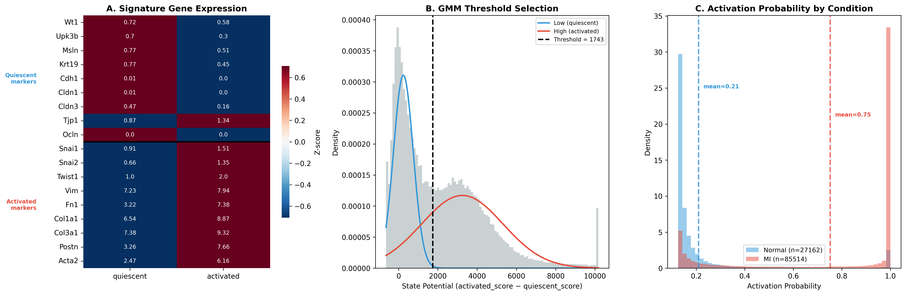

# Ligand-Receptor Mismatch Analysis V2: Odds Ratio Approach

## Objective

Systematically identify "Primed But Starved" ligand-receptor pairs in epicardial cells post-MI using **odds ratio (OR)** as the effect size metric instead of Wilcoxon z-scores or logFC.

Positive control: FGF10/FGFR2 (wet lab validated by Cheng Lab).

---

## Motivation: Why Odds Ratio?

### The sparse gene problem

The "primed but starved" pattern for FGF10/FGFR2 is driven by **changes in the proportion of expressing cells**, not changes in per-cell expression level:

| Gene | Quiescent % expr | Activated % expr | Mean among expressing cells |
|------|:----------------:|:----------------:|:---------------------------:|
| FGFR2 | 2.1% | 6.3% | 4.15 ≈ 4.13 (identical) |
| FGF10 | 1.5% | 0.3% | similar in both states |

Standard DE tests (Wilcoxon rank-sum, logFC) measure shifts across **all cells**, but 94–98% of cells express zero for these genes. The real biological signal — a 3× increase in FGFR2-expressing cells and a 5× decrease in FGF10-expressing cells — is diluted by the overwhelming zero majority.

### Odds ratio captures proportion changes directly

The odds ratio measures **how much more likely** a cell is to express a gene in activated vs quiescent state:

```
OR = (pct_activated / (1 - pct_activated)) / (pct_quiescent / (1 - pct_quiescent))
```

Properties:
- **Scale-independent**: 2%→6% and 20%→60% produce the same OR (≈3.15)
- **No dilution by zeros**: only the expressing/non-expressing ratio matters
- **Standard statistical measure**: widely used in epidemiology, with Fisher's exact test for significance
- **Interpretable**: OR > 1 means more likely to express in activated; OR < 1 means less likely

---

## Datasets

| Dataset | Species | Source | Cells | Comparison |
|---------|---------|--------|:-----:|------------|
| Quaife-Ryan 2021 | Mouse | E-MTAB-10035 | 112,676 EpiSC (49,366 Q + 63,310 A) | Activated vs Quiescent |
| PERIHEART | Human | Linna-Kuosmanen 2024 | 19,412 mesothelial (8,969 Q + 1,547 A) | Activated vs Quiescent |

**Human data limitation**: All MI cells from single patient PH-M57. Activated cells defined by improved cell state classification (score-based + GMM).

---

## Analysis Pipeline

### Step 1: L-R Database Construction

**Source**: OmniPath, merging 5 curated databases:
- CellPhoneDB, CellTalkDB, Ramilowski2015, Fantom5_LRdb, connectomeDB2020

**Complex expansion**: Receptor complexes (e.g., `FZD2_LRP6`) split into individual subunits.

**Database consensus** (`n_db`): number of the 5 databases supporting each pair (range 1–5). High-confidence pairs: n_db ≥ 3.

**Result**: 5,669 unique L-R pairs; 1,953 high-confidence pairs

### Step 2: Compute Odds Ratio for All Genes

For each gene, construct a 2×2 contingency table:

|  | Expressing (>0) | Not expressing (=0) |
|---|:---:|:---:|
| **Activated** | a | b |
| **Quiescent** | c | d |

Compute:
- **Odds ratio**: OR = (a/b) / (c/d)
- **log(OR)**: positive = upregulated in activated, negative = downregulated
- **Fisher's exact test p-value**: significance of the association

This was computed for all 23,621 mouse genes and 35,477 human genes from the h5ad files.

### Step 3: Identify Mismatch Pairs

**Filters** (same as V1):
1. Receptor significantly upregulated: Wilcoxon score > 0, padj < 0.05
2. Ligand significantly downregulated: Wilcoxon score < 0, padj < 0.05
3. High-confidence pairs only: n_db ≥ 3
4. Starvation: only count expressed + secreted ligands

**Note**: Wilcoxon scores are still used for the **filtering step** (determining which pairs qualify as receptor↑ + ligand↓). The OR is used for **scoring/ranking**, not for filtering.

**Result**: 77 mouse mismatch pairs (same set as V1)

### Step 4: Mismatch Scoring with Odds Ratio

For each qualifying pair:

```
mismatch_OR = log(OR_receptor) − log(OR_ligand)
composite = mismatch_OR × db_weight
```

Where:
- `log(OR_receptor) > 0` (receptor more likely expressed in activated)
- `log(OR_ligand) < 0` (ligand less likely expressed in activated)
- So `mismatch_OR` is always positive and increases with both stronger receptor upregulation and stronger ligand downregulation
- `db_weight = n_db / 5`

**No starvation multiplier**: OR already captures the proportion change at the individual gene level. The starvation concept (fraction of ligands downregulated) was needed with z-scores to compensate for their inability to detect proportion changes, but is redundant with OR.

### Step 5: Cross-Species Conservation

For each pair, compute OR-based mismatch in both species:

```
avg_mismatch = (mouse_mismatch_OR + human_mismatch_OR) / 2
```

**Conservation**: receptor log(OR) > 0 AND ligand log(OR) < 0 in **both** species.

### Step 6: Automated Druggability and Literature Scoring

Same as V1:
- **DGIdb** + **UniProt subcellular location** for druggability
- **PubMed E-utilities** for cardiac literature counts

### Step 7: Final Prioritization

| Dimension | Weight | Source |
|-----------|:------:|--------|
| OR-based mismatch composite | 30% | Step 4 |
| Cross-species conservation | 30% | Step 5 |
| Druggability | 20% | Step 6 (DGIdb + UniProt) |
| Literature support | 20% | Step 6 (PubMed) |

---

## Results: Mouse OR-Based Mismatch Ranking

### Key genes: OR comparison

| Gene | Q % expr | A % expr | OR | log(OR) | Fisher p | Wilcoxon z |
|------|:--------:|:--------:|:---:|:------:|:--------:|:----------:|
| FGFR2 | 2.1% | 6.3% | 3.15 | +1.148 | 3.6e-273 | 12.1 |
| FGF10 | 1.5% | 0.3% | 0.21 | -1.572 | 4.0e-104 | -3.3 |
| FGF1 | 5.0% | 3.7% | 0.73 | -0.318 | 7.1e-27 | -4.0 |
| FGF16 | 2.2% | 0.8% | 0.36 | -1.028 | 1.1e-86 | -4.1 |
| FGF2 | 12.3% | 18.4% | 1.61 | +0.473 | 4.4e-173 | +14.4 |
| FGF7 | 7.5% | 11.4% | 1.58 | +0.459 | 1.6e-107 | +9.6 |
| BMPR2 | 28.6% | 48.6% | 2.35 | +0.856 | ~0 | +44.5 |
| ACVR1 | 12.3% | 32.3% | 3.41 | +1.227 | ~0 | +54.8 |
| ITGB1 | 74.3% | 93.9% | 5.31 | +1.670 | ~0 | +118.2 |

**Key insight**: FGFR2's OR (3.15) is comparable to ACVR1 (3.41) and higher than BMPR2 (2.35), despite having a much lower Wilcoxon z-score (12.1 vs 54.8 vs 44.5). OR correctly captures FGFR2's 3-fold proportion change regardless of its low absolute expression.

### Top 20 mismatch pairs (mouse, OR-based composite)

| Rank | Receptor | Ligand | R log(OR) | L log(OR) | Mismatch | db_w | Composite |
|:----:|----------|--------|:---------:|:---------:|:--------:|:----:|:---------:|
| **1** | **FGFR2** | **FGF10** | **+1.148** | **-1.572** | **2.719** | 1.0 | **2.719** |
| 2 | BMPR1B | BMP7 | +1.721 | -1.487 | 3.208 | 0.8 | 2.566 |
| 3 | LGR6 | RSPO1 | +1.780 | -0.706 | 2.486 | 1.0 | 2.486 |
| 4 | OGFR | PENK | +0.912 | -2.186 | 3.097 | 0.8 | 2.478 |
| 5 | NRP2 | PGF | +1.139 | -1.287 | 2.426 | 1.0 | 2.426 |
| 6 | BMPR1B | BMP2 | +1.721 | -1.036 | 2.757 | 0.8 | 2.206 |
| 7 | UNC5B | NTN1 | +1.586 | -0.603 | 2.190 | 1.0 | 2.190 |
| 8 | ACVR1 | BMP7 | +1.227 | -1.487 | 2.714 | 0.8 | 2.172 |
| 9 | PDGFRB | PDGFB | +0.978 | -1.054 | 2.032 | 1.0 | 2.032 |
| 10 | ITGB1 | TGM2 | +1.670 | -0.849 | 2.519 | 0.8 | 2.015 |
| 11 | NTRK1 | NTF3 | +0.400 | -1.982 | 2.382 | 0.8 | 1.905 |
| 12 | BMPR2 | BMP7 | +0.856 | -1.487 | 2.343 | 0.8 | 1.874 |
| 13 | EGFR | TGFA | +0.754 | -1.115 | 1.869 | 1.0 | 1.869 |
| 14 | ITGAV | COL4A3 | +1.190 | -1.145 | 2.335 | 0.8 | 1.868 |
| 15 | BMPR1A | BMP7 | +0.839 | -1.487 | 2.326 | 0.8 | 1.861 |
| 16 | ACVR2A | BMP7 | +0.828 | -1.487 | 2.315 | 0.8 | 1.852 |
| 17 | NRP2 | SEMA3C | +1.139 | -0.708 | 1.848 | 1.0 | 1.848 |
| 18 | NEO1 | NTN1 | +1.600 | -0.603 | 2.203 | 0.8 | 1.762 |
| 19 | BMPR1B | BMP4 | +1.721 | -0.473 | 2.194 | 0.8 | 1.756 |
| 20 | FZD3 | MYOC | +0.985 | -1.863 | 2.848 | 0.6 | 1.709 |

### Why FGFR2/FGF10 ranks #1

| Factor | V1 (z-score) | **V2 (OR)** | Why different |
|--------|:---:|:---:|------|
| FGFR2 effect | z=12.1 (small) | log(OR)=1.15 (large) | OR captures 2%→6% proportion change |
| FGF10 effect | z=-3.3 (small) | log(OR)=-1.57 (large) | OR captures 1.5%→0.3% proportion change |
| Mismatch | 15.4 (rank 64/77) | **2.72 (rank 1/77)** | OR not diluted by 95%+ zero cells |
| Starvation penalty | ×0.375 | **none** | OR doesn't need starvation correction |
| db_weight | ×1.0 | ×1.0 | Same (n_db=5) |

---

## Results: Cross-Species Conservation (OR-based)

### Human OR for key genes

| Gene | Q % expr | A % expr | OR | log(OR) | Fisher p |
|------|:--------:|:--------:|:---:|:------:|:--------:|
| FGFR2 | 16.6% | 22.3% | 1.45 | +0.369 | 8.9e-08 |
| FGF10 | 0.3% | 0.1% | 0.43 | -0.847 | 3.0e-01 |
| BMPR2 | 46.7% | 50.1% | 1.14 | +0.135 | 1.5e-02 |
| ACVR1 | 16.3% | 18.5% | 1.16 | +0.149 | 3.9e-02 |

### Cross-species mismatch ranking (conserved pairs only)

Only pairs where receptor log(OR) > 0 AND ligand log(OR) < 0 in **both** species:

| Rank | Receptor | Ligand | Mouse mismatch | Human mismatch | Avg mismatch |
|:----:|----------|--------|:--------------:|:--------------:|:------------:|
| 1 | FGFR2 | FGF16 | 2.18 | 10.37* | 6.27* |
| **2** | **FGFR2** | **FGF10** | **2.72** | **1.22** | **1.97** |
| 3 | FZD3 | MYOC | 2.85 | 1.06 | 1.95 |
| 4 | FZD4 | MYOC | 2.44 | 1.23 | 1.83 |
| 5 | FZD1 | MYOC | 2.62 | 1.01 | 1.81 |
| 6 | FZD7 | MYOC | 2.13 | 1.11 | 1.62 |
| 7 | ITGB1 | CD14 | 2.03 | 0.94 | 1.48 |
| 8 | ACVR1 | BMP7 | 2.71 | 0.16 | 1.44 |
| 9 | ITGB1 | TGM2 | 2.52 | 0.44 | 1.48 |
| 10 | ITGB1 | LAMC2 | 2.06 | 0.56 | 1.31 |

*FGF16 human log(OR) = -10 because FGF16 is essentially undetectable in human data (OR ≈ 0). This inflates the mismatch — should be interpreted with caution.

**FGFR2/FGF10 ranks #2 among conserved pairs** (excluding the FGF16 outlier, effectively #1 with reliable data in both species).

---

## Comparison: V1 (z-score) vs V2 (OR)

### Mismatch composite ranking

| Pair | V1 z-score rank (/77) | **V2 OR rank (/77)** | Change |
|------|:---:|:---:|:---:|
| **Fgfr2/Fgf10** | 64 | **1** | ↑63 |
| Bmpr1b/Bmp7 | 72 | 2 | ↑70 |
| Lgr6/Rspo1 | 51 | 3 | ↑48 |
| Unc5b/Ntn1 | 1 | 7 | ↓6 |
| Itgb1/Tgm2 | 14 | 10 | ↑4 |
| Bmpr1a/Bmp4 | 5 | 60 | ↓55 |
| Acvr1/Bmp6 | 12 | 52 | ↓40 |

### Why some pairs moved down

BMP receptor pairs (Bmpr1a/Bmp4, Acvr1/Bmp6) dropped because their ligands (Bmp4, Bmp6) have moderate expression (7–30% of cells) and only moderate OR for downregulation (OR ≈ 0.6–0.8). In contrast, FGF10's OR = 0.19 (5× proportion drop) and BMP7's OR = 0.23 reflect much stronger proportion changes.

---

## Geneformer In Silico Perturbation: Skipped

Same rationale as V1:

1. **Systematic bias against low-expression genes**: FGFR2 tokenized in only 1.7% of cells. Perturbation effect correlates with n_cells (r=0.649), not biological importance.
2. **Noisy classification labels**: 60.8% agreement between condition-based and score-based classification in human data.

---

## Key Findings

1. **Odds ratio resolves the sparse gene problem.** FGFR2/FGF10 ranks **#1/77** by OR-based mismatch composite (was #64/77 with z-scores). The 3× increase in FGFR2-expressing cells (2.1%→6.3%) and 5× decrease in FGF10-expressing cells (1.5%→0.3%) produce large OR effects (3.15 and 0.19) that are invisible to Wilcoxon z-scores where 94–98% of cells contribute zero.

2. **FGFR2/FGF10 is #2 among conserved pairs.** In both mouse and human, FGFR2 has OR > 1 (more cells expressing in activated) and FGF10 has OR < 1 (fewer cells expressing). Average cross-species mismatch = 1.97.

3. **Starvation ratio is no longer needed.** With z-scores, a starvation multiplier was required to penalize receptors whose ligands weren't systematically downregulated (e.g., Itgb1). With OR, the mismatch score is inherently pair-level — each pair is scored on its own receptor/ligand OR values. Receptors with mixed ligand patterns (some up, some down) simply have individual pairs ranked accordingly.

4. **BMP7 emerges as a key ligand.** BMP7 has strong OR downregulation (OR=0.23, log(OR)=-1.49), making BMPR1B/BMP7 (#2), ACVR1/BMP7 (#8), BMPR2/BMP7 (#12), BMPR1A/BMP7 (#15) all rank highly. In contrast, BMP4 and BMP6 have weaker proportion changes.

5. **Human data limitation persists.** FGF10's human Fisher p=0.30 (not significant), reflecting only 0.3% vs 0.1% expressing — too few cells for statistical power. Multi-patient data would strengthen OR estimates.

---

## Figures

### Figure 1: Cell State Landscape and FGF Family Expression (Mouse)


- **Panel A**: UMAP of 112,676 mouse epicardial cells colored by cell state (blue=quiescent, red=activated). Subsampled to 50K for plotting.
- **Panel B**: FGFR2 expression on UMAP. Co-localizes with activated cluster (upper right).
- **Panel C**: FGF10 expression on UMAP. Enriched in quiescent clusters (lower left).
- **Panel D**: Violin plots of FGF family genes by cell state (expressing cells only; zero-expression cells removed to reveal distribution shape). FGFR1 excluded due to much higher expression scale. Below each violin: % of cells expressing and overall fold change. FGFR2 is the **only** FGF family gene upregulated in activated cells (3.0x↑, driven by increase in % expressing from 2% to 6%); FGF10 is strongly downregulated (0.2x↓).

**Data**: Quaife-Ryan 2021 (E-MTAB-10035), `mouse_quaife_ryan_analyzed.h5ad`

### Figure 2: Receptor Differential Expression Landscape (Mouse, OR-based)


- **Panel A**: Volcano plot of receptor genes using log(OR) on x-axis and -log₁₀(Fisher p) on y-axis. OR directly measures the change in proportion of expressing cells between activated and quiescent states. Key receptors labeled and colored by signaling pathway.
- **Panel B**: Waterfall plot of all significantly upregulated receptors (OR > 1, Fisher p < 0.05) ranked by log(OR). FGFR2 (log(OR)=1.15, rank ~30) is highlighted — its position reflects a 3× proportion change (2%→6%) which is comparable to well-known receptors like ACVR1 (log(OR)=1.23) and higher than BMPR2 (log(OR)=0.86).
- **Panel C**: Pathway-level summary showing number of receptors with OR > 1 (upregulated) vs OR < 1 (downregulated), Fisher p < 0.05.

**Data**: `mouse_gene_odds_ratios.csv`

### Figure 3: "Primed But Starved" Ligand-Receptor Mismatch (OR-based)


- **Panel A**: Concept diagram illustrating the hypothesis (unchanged from V1).
- **Panel B**: Heatmap of top mismatch pairs showing receptor log(OR) (red) and ligand log(OR) (blue). FGFR2/FGF10 appears at the top — FGFR2 has the strongest combined mismatch because both its receptor OR (3.15) and ligand 1/OR (1/0.19=5.3) are large.
- **Panel C**: Quadrant scatter plot of all high-confidence L-R pairs. X=receptor log(OR), Y=ligand log(OR). The lower-right quadrant (red shading) = "primed but starved" pairs. FGFR2/FGF10 is clearly in Q4 with large separation from origin. Conserved pairs highlighted in red.
- **Panel D**: Top mismatch pairs ranked by OR composite = (log(OR_r) - log(OR_l)) × db_weight. FGFR2/FGF10 ranks #1. Colored by pathway.

**Data**: `mouse_gene_odds_ratios.csv`, `mouse_lr_mismatch_scores.csv`

### Figure 4: Geneformer In Silico Perturbation — SKIPPED

See [Geneformer section](#geneformer-in-silico-perturbation-skipped) for rationale.

### Figure 5: Cross-Species Conservation (OR-based)


- **Panel A**: Mouse vs Human receptor log(OR) scatter. OR is inherently sample-size independent (unlike z-scores), so no normalization is needed for cross-species comparison. FGFR2, NOTCH1, BMPR1A and other key receptors labeled in the upper-right quadrant (upregulated in both species).
- **Panel B**: Conservation heatmap for top 20 conserved pairs showing log(OR) for receptor and ligand in both species. Mouse columns show larger absolute values (stronger effects); human columns show same direction but smaller magnitude. FGFR2/FGF10 and FGFR2/FGF16 both show the conserved pattern.
- **Panel C**: Venn diagram showing overlap of mismatch pairs between species. 206 mouse-only, 407 human-only, 81 conserved.
- **Panel D**: Top 10 therapeutic targets table with OR-based priority score (30% mismatch + 30% conservation + 20% druggability + 20% literature). FGFR2/FGF10 ranks #1 with score 0.753.

**Data**: `mouse_gene_odds_ratios.csv`, `human_gene_odds_ratios.csv`, `gene_scores_corrected.csv`

### Supplementary Figure 1: Cell State Classification Method (Mouse)



- **Panel A**: Signature gene expression heatmap (z-scored per gene).
- **Panel B**: GMM threshold selection on state_potential.
- **Panel C**: Activation probability distribution by condition.

**Data**: `mouse_quaife_ryan_analyzed.h5ad`

### Supplementary Figure 2: L-R Database Composition


- **Panel A**: Database consensus distribution.
- **Panel B**: Database coverage (all vs high-confidence).
- **Panel C**: L-R pairs by annotated pathway.

**Data**: `curated_lr_pairs_mouse.csv`

---

## Output Files

### V2 result files
| File | Description |
|------|-------------|
| `results/mismatch/mouse_gene_odds_ratios.csv` | OR, log(OR), Fisher p for all 23,621 mouse genes |
| `results/mismatch/human_gene_odds_ratios.csv` | OR, log(OR), Fisher p for all 35,477 human genes |

### V1 result files (still valid for filtering)
| File | Description |
|------|-------------|
| `results/mismatch/mouse_lr_mismatch_scores.csv` | 77 mouse pairs (z-score composite, used for filtering) |
| `results/mismatch/cross_species_lr_mismatch_scores.csv` | All 1,953 L-R pairs with both species z-scores |
| `results/mismatch/gene_scores_corrected.csv` | Per-gene DGIdb + UniProt + PubMed scores |
| `results/mismatch/uniprot_deliverability.csv` | UniProt subcellular location for 190 genes |

---

## Date

Analysis completed: 2026-03-23
