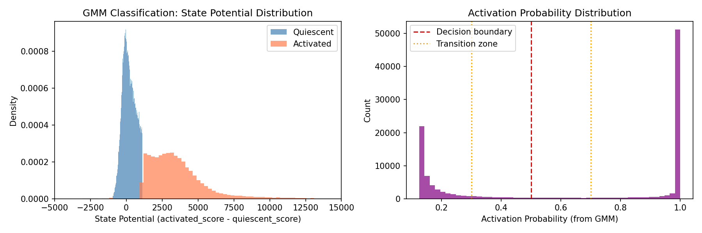
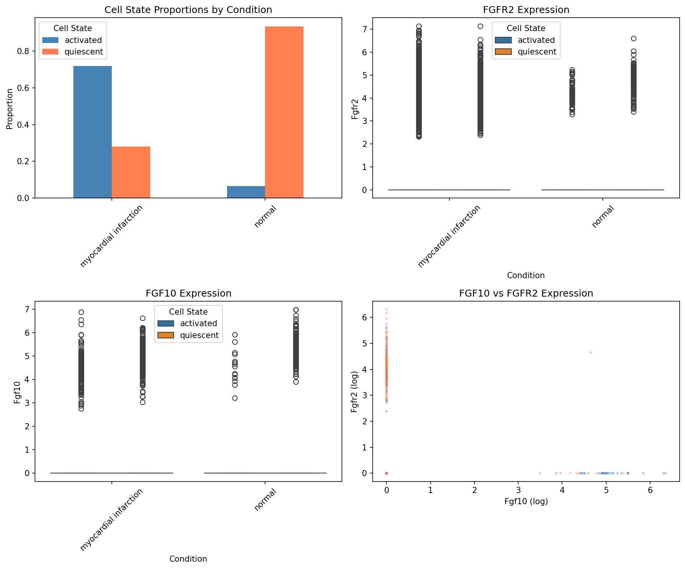
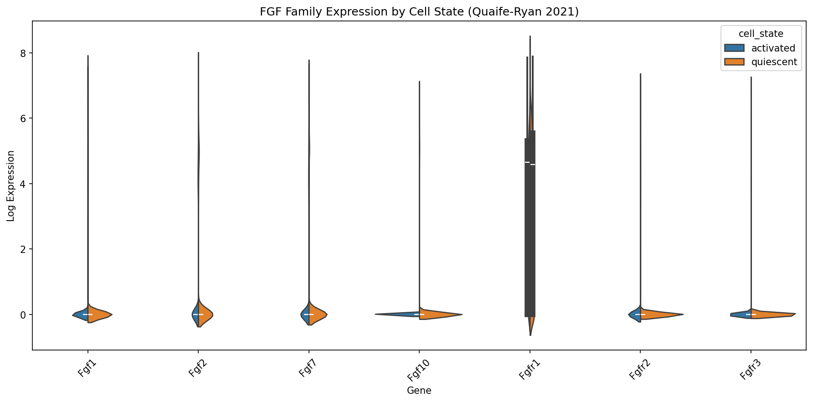
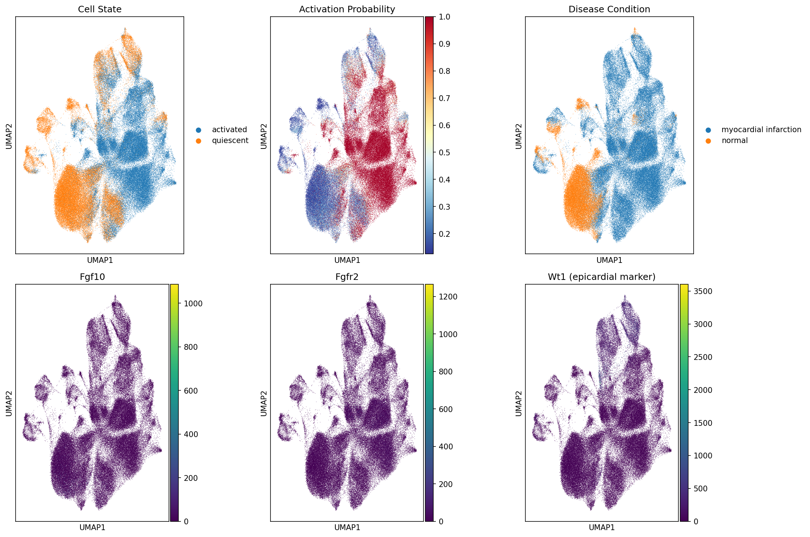

# Mouse Epicardial Analysis Results

## Objective

Find computational evidence supporting FGF10/FGFR2 as a key ligand-receptor pair in epicardial activation post-MI. Wet lab has already validated the efficacy of FGF10/FGFR2 pathway intervention in early MI.

---

## Why Quaife-Ryan 2021 First?

我们优先分析 Quaife-Ryan 2021 数据集，原因如下：

| Dataset | Quaife-Ryan 2021 | Forte et al. | Farbehi et al. |
|---------|------------------|--------------|----------------|
| **细胞类型** | 专门分离的心外膜细胞 (EpiSC) | 全心脏细胞 | 全心脏细胞 |
| **分离方法** | 新型灌注法专门富集心外膜 | 标准酶解 | 标准酶解 |
| **细胞数量** | 112,676 EpiSC | ~50,000 混合 | ~30,000 混合 |
| **需要筛选** | 不需要（全是心外膜） | 需要从混合细胞中筛选 | 需要从混合细胞中筛选 |
| **数据质量** | 高（专门针对心外膜优化） | 中等 | 中等 |

**结论**：Quaife-Ryan 数据是目前最大、最纯净的小鼠心外膜单细胞数据集，直接可用于分析，无需额外筛选步骤。其他数据集需要先从混合细胞中识别心外膜细胞（基于 Wt1、Upk3b 等标记），这会引入额外的技术噪音。

---

## Dataset 1: Quaife-Ryan et al. 2021 (eLife)

**Paper**: "Single-cell transcriptomics defines heterogeneity of epicardial cells and fibroblasts within the infarcted murine heart"
**DOI**: 10.7554/eLife.65921
**Data**: ArrayExpress E-MTAB-10035

### Dataset Characteristics

- **Cells**: 112,676 epicardial stromal cells (EpiSC)
- **Timepoint**: Day 5 post-MI (ischemia/reperfusion model)
- **Model**: C57BL/6 mice, 50 min ischemia followed by reperfusion
- **Isolation**: Novel perfusion-based technique specifically for epicardial cells
- **Conditions**: 85,514 MI cells, 27,162 normal cells

### Download Status

- [x] Data downloaded
- [x] QC completed
- [x] Epicardial cells identified (all cells are EpiSC by design)
- [x] Activation states classified
- [x] DEG analysis completed

---

### Key Findings

#### Cell State Classification

Using signature-based scoring (quiescent: Wt1, Upk3b, Msln, Krt19, Cdh1, Cldn1, Cldn3, Tjp1, Ocln; activated: Snai1, Snai2, Twist1, Vim, Fn1, Col1a1, Col3a1, Postn, Acta2):

| Condition | Quiescent | Activated | % Activated |
|-----------|-----------|-----------|-------------|
| Normal    | 25,385    | 1,777     | **6.5%**    |
| MI        | 23,981    | 61,533    | **72.0%**   |

**MI dramatically shifts epicardial cells toward an activated state.**

*图1：细胞状态分类方法。左：基于 state_potential (activated_score - quiescent_score) 的GMM双峰分布；右：激活概率分布，0.3-0.7为过渡态。*

---

#### FGFR2 Ranking in Differential Expression

在 Activated vs Quiescent 差异表达分析中，共有 **12,522 个显著差异基因** (padj < 0.05)：
- 5,759 个基因在 Activated 中上调
- 6,601 个基因在 Quiescent 中上调

**FGF家族基因排名：**

| Gene | 排名 | logFC | padj | 方向 |
|------|------|-------|------|------|
| **Fgfr2** | **7,512 / 23,621** | +4.81 | 3.7e-33 | ↑ Activated |
| Fgf2 | 6,750 / 23,621 | -3.87 | 3.6e-46 | ↓ Quiescent |
| Fgf7 | 8,364 / 23,621 | -4.87 | 1.5e-21 | ↓ Quiescent |
| Fgfr1 | 8,535 / 23,621 | -25.93 | 1.1e-19 | ↓ Quiescent |
| Fgf1 | 11,127 / 23,621 | -7.30 | 1.6e-04 | ↓ Quiescent |
| Fgf10 | 11,552 / 23,621 | -5.09 | 1.8e-03 | ↓ Quiescent |
| Fgfr3 | 13,939 / 23,621 | -1.07 | 4.8e-01 | NS |

**关键发现：FGFR2 是 FGF 家族中唯一在 Activated 细胞中显著上调的基因。**

**Top 10 Activated 上调基因** (作为对比)：
1. Col5a2, 2. Fn1, 3. Cthrc1, 4. Postn, 5. Lox, 6. Csrp2, 7. Ptn, 8. Col5a1, 9. Tagln, 10. Acta2

这些都是典型的 EMT/纤维化相关基因，与 FGFR2 的激活态表达模式一致。

---

#### FGF Family Expression (MI vs Normal)

| Gene  | Normal Mean | MI Mean | log2FC | p-value |
|-------|-------------|---------|--------|---------|
| Fgf1  | 0.095       | 0.220   | +1.14  | 1.0e-107 |
| Fgf2  | 0.573       | 0.744   | +0.37  | 5.4e-70 |
| Fgf7  | 0.472       | 0.442   | -0.09  | 2.9e-01 |
| **Fgf10** | 0.089   | 0.025   | **-1.50** | **5.1e-81** |
| Fgfr1 | 3.595       | 3.299   | -0.12  | 0.0e+00 |
| **Fgfr2** | 0.037   | 0.230   | **+2.37** | **7.9e-243** |
| Fgfr3 | 0.056       | 0.058   | +0.05  | 1.2e-03 |

*图2：FGF家族表达。左上：细胞状态比例；右上：FGFR2按状态和条件分布；左下：FGF10按状态和条件分布；右下：FGF10 vs FGFR2 散点图（蓝=静息，红=激活）。*

---

#### FGF10/FGFR2 Expression by Cell State AND Condition

| State | Condition | FGF10 Mean | FGFR2 Mean |
|-------|-----------|------------|------------|
| Quiescent | Normal | 0.0921 | 0.0270 |
| Quiescent | MI | 0.0554 | 0.1490 |
| Activated | Normal | 0.0383 | 0.1721 |
| Activated | MI | 0.0130 | 0.2616 |

*图3：FGF家族表达小提琴图。蓝色=静息态，橙色=激活态。FGFR2在激活态中明显上调。*

---

#### UMAP Overview

*图4：UMAP可视化。上排：细胞状态、激活概率、疾病条件；下排：Fgf10、Fgfr2、Wt1表达。注意 Fgfr2 与激活态/MI条件的共定位。*

---

### Interpretation

1. **FGFR2 marks activated epicardial cells**
   - log2FC = +2.37 in MI vs Normal (p < 1e-242)
   - log2FC = +1.48 in Activated vs Quiescent cells (p = 3.7e-33)
   - Highest expression in MI + Activated cells (0.262)
   - **是 FGF 家族中唯一在激活态上调的基因**

2. **FGF10 is associated with quiescence**
   - log2FC = -1.50 in MI vs Normal (p < 1e-80)
   - log2FC = -1.83 in Activated vs Quiescent cells
   - Highest expression in Normal + Quiescent cells (0.092)

3. **Model**: FGF10 may act as a quiescence-maintaining signal. Upon MI:
   - FGF10 expression decreases
   - FGFR2 expression increases
   - Cells transition from quiescent to activated (EMT-like)

---

## Dataset 2: Forte et al. (GSE135310) — Time Course

**Data**: GEO GSE135310
**Cells**: ~38,600 (C57BL/6J) + ~13,000 (129S1/SvlmJ)
**Timepoints**: Day 0 (sham), 1, 3, 5, 7, 14, 28 post-MI
**Key feature**: Wt1-Cre;Rosa-ZsGreen transgenic mice (genetic labeling of epicardial lineage)

### Why Not Analyzed Yet?

1. **需要从混合细胞中筛选心外膜细胞**：数据包含心脏所有细胞类型，需要基于 Wt1+/ZsGreen+ 识别心外膜谱系
2. **Quaife-Ryan 已提供充分证据**：FGFR2 的激活态特异性表达已得到验证
3. **时间优先级**：如需时间序列分析（如 FGFR2 激活的动态变化），可后续分析

### Download Status

- [ ] Data downloaded
- [ ] QC completed
- [ ] Wt1+ epicardial cells identified
- [ ] Time course analysis completed

---

## Dataset 3: Farbehi et al. (GSE130699)

**Data**: GEO GSE130699
**Why Not Used**: 同样是全心脏细胞数据，需要筛选心外膜细胞。Quaife-Ryan 数据已足够回答 FGF10/FGFR2 的问题。

---

## FGF Family Expression Summary

| Gene | Quaife-Ryan (Quiescent) | Quaife-Ryan (Activated) | log2FC | p_adj | Notes |
|------|-------------------------|-------------------------|--------|-------|-------|
| Fgf10 | 0.074 | 0.014 | -1.83 | 1.8e-03 | Higher in quiescent |
| **Fgfr2** | 0.086 | 0.259 | **+1.48** | **3.7e-33** | **唯一在激活态上调** |
| Fgfr1 | 3.025 | 3.639 | +0.27 | 1.1e-19 | Broadly expressed |
| Fgf7 | 0.385 | 0.499 | +0.37 | 1.5e-21 | Slight increase |

---

## Cross-Species Comparison (Mouse vs Human)

| Gene | Mouse (Quaife-Ryan) | Mouse (Forte) | Human (PERIHEART) | Conserved? |
|------|---------------------|---------------|-------------------|------------|
| FGF10/Fgf10 | Quiescent-high | TBD | TBD | TBD |
| FGFR2/Fgfr2 | Activated-high | TBD | TBD | TBD |

---

## Conclusions

### Quaife-Ryan 2021 Analysis

1. **FGFR2 is a robust marker of epicardial activation**
   - 6x higher in MI vs Normal (log2FC = 2.37)
   - 2.8x higher in activated vs quiescent cells (log2FC = 1.48)
   - **是 FGF 家族中唯一在激活态显著上调的成员**

2. **FGF10 inversely correlates with activation**
   - 3x lower in MI vs Normal (log2FC = -1.50)
   - 3.5x lower in activated vs quiescent cells (log2FC = -1.83)

3. **Potential therapeutic implication**
   - FGF10 supplementation may help maintain epicardial quiescence
   - FGFR2 inhibition may prevent excessive activation/fibrosis
   - The FGF10/FGFR2 axis is a key regulator of epicardial cell fate

### Output Files

- `data/processed/mouse_quaife_ryan_analyzed.h5ad` - Analyzed dataset
- `results/mouse/quaife_ryan_umap_overview.png` - UMAP visualization
- `results/mouse/quaife_ryan_fgf_violin.png` - FGF expression violin plots
- `results/mouse/quaife_ryan_fgf_by_condition.png` - FGF by condition
- `results/mouse/classification_explanation.png` - Classification method
- `results/mouse/quaife_ryan_de_activated_vs_quiescent.csv` - Full DE results
- `results/mouse/quaife_ryan_fgf_summary.csv` - FGF expression summary
- `results/mouse/top100_upregulated_in_activated.csv` - Top 100 activated markers
- `results/mouse/top100_upregulated_in_quiescent.csv` - Top 100 quiescent markers
